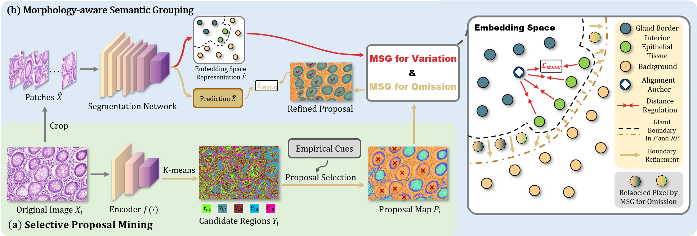

## MSSG

Qixiang ZHANG, Yi LI, Cheng XUE, Xiaomeng LI*, "Morphology-inspired Unsupervised Gland Segmentation via Selective Semantic Grouping", MICCAI 2023 (Accepted).


### 1. Introduction
This MSSG framework is designed for unsupervised gland segmentation on histology images, containing two modules. The first Selective Proposal Mining (SPM) module generates proposals for different gland sub-regions. And the Morphology-aware Semantic Grouping (MSG) module groups the semantics of the sub-region proposal to obtain comprehensive knowledge about glands.




### 2. Environment

This code has been tested with Python 3.9, PyTorch 1.12.0, CUDA 11.3 mmseg 0.8.0 and mmcv 1.4.0 on Ubuntu 20.04.


### 3. Preparation

Download GlaS dataset from [Official Website](https://warwick.ac.uk/fac/cross_fac/tia/data/glascontest/), and place the dataset as following:

```shell
/your/directory/SPM/
      └── glas/
            ├── training_images/
            │     ├── xxxxxxxxx.bmp
            │     └── ...
            └── training_gts/
                  ├── xxxxxxxxx.bmp
                  └── ...
```

Install Python library dependencies
```shell
pip install -r requirements.txt
```

Install MMSegmentation codebase, see [documentation](https://mmsegmentation.readthedocs.io/en/latest/) from MMLab for details.


### 4. Training for SPM Module

**You can simply download the pre-generated proposal map from [Link to Proposal Map](https://pan.baidu.com/s/1wDJ7JVcT0KgeUa-03gGLBg) with extracted code rzgp**

Or use the SPM module to generate candidate proposals for each histology image, and use the empirical cue to select gland sub-region proposals

```shell
cd SPM
python SPM.py --train_image_path ../glas/training_images --output_root result --nConv 3 --cluster_num 5
```


### 5. Training for MSG Module

Crop the training image and the proposal map

```shell
cd MSG
python tools/crop_img_and_gt.py MSG/glas/images SPM/proposal_map MSG/glas
```


Train the segmentation model with MSG modules.

```shell
cd MSG
bash tools/dist_train.sh configs/pspnet_mssg/pspnet_wres38-d8_10k_histo.py 4 runs/mssg
```


### 6. Results and Visualization of Pseudo-masks

| Method                                        | mIOU   | Weight                                                       | Pseudo-mask                                                  |
| --------------------------------------------- | ------ | ------------------------------------------------------------ | ------------------------------------------------------------ |
| Our MSSG                                      | 62.72% | [Download Link](https://pan.baidu.com/s/1JmoOuNmpdmaK6vcONcWr7g) (Extracted Code: jjey) | [Download Link](https://pan.baidu.com/s/1BvjmzHeXpS--ucmmrhVuMQ) (Extracted Code: 9zvb) |
| SGSCN [[1](https://arxiv.org/abs/2107.04934)] | 52.61% | Coming Soon                                                  | Coming Soon                                                  |
| PiCIE [[2](https://arxiv.org/abs/2103.17070)] | 48.77% | Coming Soon                                                  | Coming Soon                                                  |

*The backbone of all methods above are the same, i.e., PSPNet
